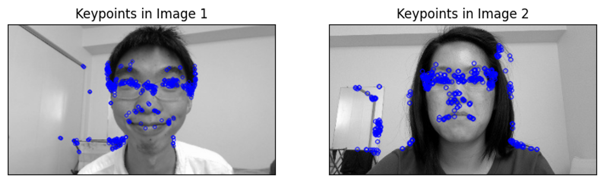
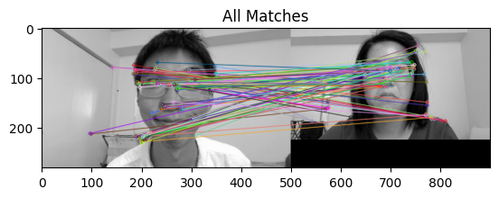
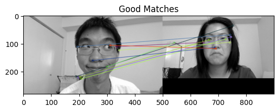
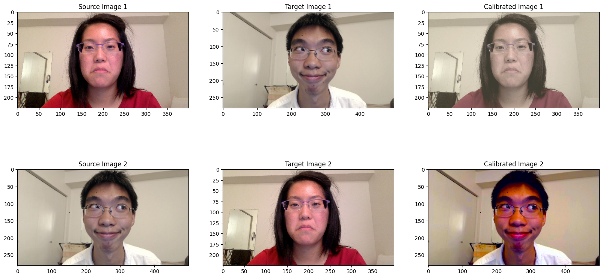
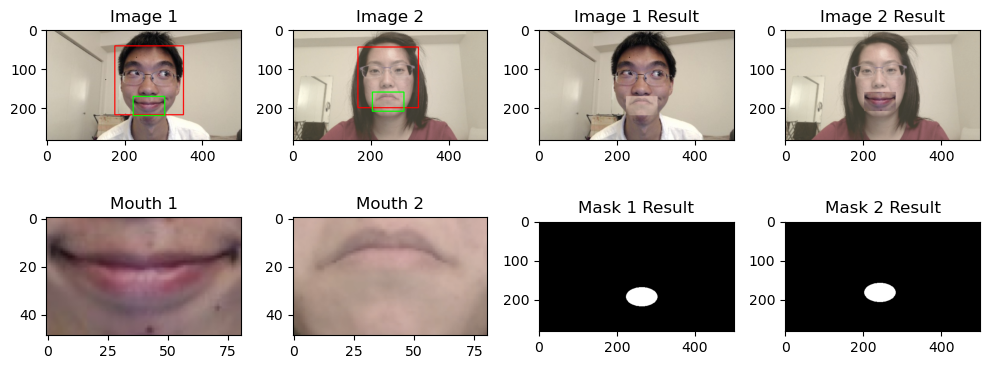
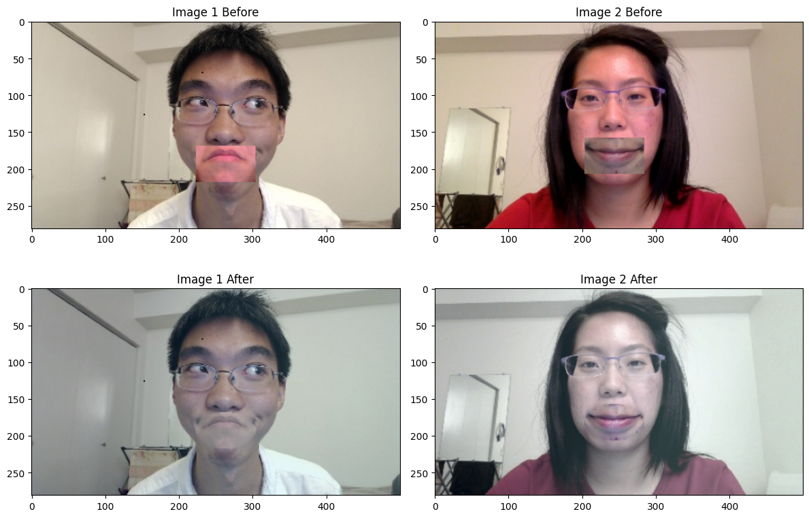

# Lip-Flip

# 1. Introduction

Our project, 'Lip-Flip', aims to introduce a sophisticated technique that allows for the interchange of lips between two individuals' photographs. This innovative approach not only facilitates the swapping of lips but also ensures a seamless and natural integration of the swapped features. The essence of 'Lip-Flip' lies in its ability to create a unique and personalized visual experience, enhancing the interactive aspect of digital imagery. Through this project, we explore the realms of advanced image manipulation, setting a new standard for customized photo editing.

# 2. Processing Pipeline

Our methodology is outlined in Figure 1, providing a visual summary of the process. The pipeline initiates with a calibration phase upon system startup, focusing on color and luminance adjustments. We calculate a transformation matrix to harmonize the visual attributes of images captured by different webcams. This matrix is consistently applied to all subsequent frames.

Figure 1: Processing Pipeline

In the next phase, each frame undergoes facial detection using the Haar cascade algorithm, identifying the facial region. For mouth localization, we employ a specialized mouth detection algorithm, concentrating primarily on the lower half of the facial area. If the mouth is not detectable, an estimated region is inferred based on the facial coordinates.

The final step involves the swapping of mouth regions between frames. Each transferred mouth is scaled to fit the recipient face's dimensions, ensuring a natural appearance. To seamlessly integrate the mouth into the new face, we apply Laplacian blending. The processed frames are then displayed, and this detection-to-display cycle continues in real time, enabling dynamic interaction within the application.

# 3. Color Calibration

## 3.1 Objective of Color Calibration:

The primary goal of color calibration in our pipeline is to ensure that images from two different users exhibit similar brightness and color characteristics. This step is crucial because, without addressing the variances between the two frames, the swapped lips would stand out conspicuously. Such discrepancies would result in each lip segment displaying a distinct appearance, regardless of whether the two subjects share the same skin color. 

## 3.1 Steps Involved:

Here’s the flow of steps involved in Color calibration:

### 3.1.1 Preprocessing of Images:

1. **Preparation and Validation:**
    - Validate that both images (`img_1` and `img_2`) are not `None`.
    - Ensure that the dimensions of both images match.
    - If any of these checks fail, the function returns `False`.
2. **Extracting Color Values:**
    - Split each image into its BGR (Blue, Green, Red) channels.
    - Reshape these channels into one-dimensional arrays and stack them, adding an additional row of ones for a homogeneous coordinate system. This results in two matrices, `BGRval_1` and `BGRval_2`, each representing the color values of the corresponding image.

### 3.1.2 Finding Gain Transform Matrix

1. **Finding Matching Points (if `useKeypoints` is True):**
    - Convert the images to grayscale.
    - Use ORB (Oriented FAST and Rotated BRIEF) to detect and compute keypoints and descriptors.
    - Match these descriptors between the two images using the brute-force matcher.
    - Filter good matches based on a distance criterion.
    - Find a homography matrix using these matches.
    - Extract inliers (points that fit the model well) based on the homography.
2. **Building the Color Matrices for Gain Transformation:**
    - Depending on the method used (`useKeypoints`), either use the color values at the inlier points or the entire image.
    - In the case of keypoints, the color values (`BGRval_1` and `BGRval_2`) are taken from the inlier points. Otherwise, they are taken from the whole image (as prepared in step 2).
3. **Computing the Gain Transformation Matrix:**
    - Calculate the transformation matrix using linear algebra. This matrix is obtained by solving a least-squares problem which aligns the color values from one image to the other.

### 3.1.3 **Applying the Gain Transformation:**

- Convert the image into a matrix where each pixel's BGR values are a row, with an additional column of ones.
- Multiply this matrix by the transformation matrix to adjust the color values.
- Extract the transformed channels and merge them to form the final image.

And after applying gain transformation, we get a image calibrated with respect to another image. 

### 3.1.4 If number of common keypoints are not sufficient:

If the number of common kepoints are no sufficient to calculate the matrix, we can use another yet simple color calibration method.

This method is a color calibration technique that aligns the color profile of a source image to match that of a target image. It works by converting both images to the LAB color space, calculating the mean and standard deviation of each color channel (L, a, b) for both images, and then adjusting the source image's channels to match the color statistics of the target image. Finally, it reconverts the calibrated image back to the BGR color space. This process ensures the source image's color tone and distribution closely resemble those of the target image.

### 3.1.5 Results of Color Calibration:

1. Keypoints and Descriptor Detection using ORB:

1. All Matches:

1. Good Matches:

1. Final Results of color calibration

### 3.1.6 More on the concepts used:

1. **ORB (Oriented FAST and Rotated BRIEF):**
    - ORB is a feature detector and descriptor. It is used to identify and describe unique points (features) in an image which can be used for matching across different images.
    - 'FAST' (Features from Accelerated Segment Test) is used for detecting keypoints (distinctive points in the image, like corners). It's fast and efficient in finding these points.
    - 'BRIEF' (Binary Robust Independent Elementary Features) creates descriptors for these keypoints, which are basically a compact and efficient representation of the keypoints' surroundings.
    - The 'Oriented' and 'Rotated' aspects of ORB add robustness to rotation and changes in orientation, making the feature matching more reliable.
2. **Brute-Force Matcher:**
    - A brute-force matcher simply compares a descriptor in one image to every descriptor in the other image to find matches. It's straightforward but computationally intensive.
    - It looks for the closest match of a descriptor in one image to a descriptor in the other, typically using a distance measure like the Euclidean distance.
3. **Filtering Good Matches:**
    - After the brute-force matching, a filtering step is used to keep only the 'good' matches.
    - This is often done using a distance criterion, such as keeping matches where the distance between descriptors is less than a certain threshold or a fraction of the minimum distance found. This helps to eliminate poor matches.
4. **Homography Matrix:**
    - A homography is a 3x3 transformation matrix that relates all points in one image to their corresponding points in another image, assuming the images are of a planar scene or the camera motion is purely rotational.
    - It's used in various applications like image stitching or 3D reconstruction. In the context of your code, it's used for aligning the images or finding consistent regions across them.
5. **Inliers:**
    - Inliers are points that fit well with the computed model (in this case, the homography matrix).
    - When calculating the homography, some matches (outliers) might not fit well due to inaccuracies or noise. Inliers are those matches that align well according to the homography, indicating they are likely to be true correspondences between the two images.

# 4. Object Detection

The Object Detection pipeline employs the Viola-Jones object detection framework, utilizing Haar Cascade classifiers. The process begins with face detection in each frame, focusing on the largest face for subsequent steps. Mouth detection follows, specifically targeting the bottom half of the face region with nested cascades to minimize false positives. In cases where no mouth is found, the lower third of the face region is considered as the "detected" mouth. The detected mouth regions are then expanded to be slightly larger than the initially detected area to provide more pixels for blending in the next step. The actual mouth swap involves replacing pixels in the original image's mouth region with those from the detected mouth region. Furthermore, dynamic scaling is applied to each detected mouth region, matching the width of the opposite mouth region. This dynamic scaling accounts for variations in face and mouth sizes across frames, contributing to a realistic and proportional swap effect. Overall, the pipeline aims to deliver an effective and convincing real-time mouth swapping experience.

## 4.1 Steps Involved:

### 4.1.1 Detect face and mouth in image:

This method takes an image (**`img`**) as input and detects the largest face and mouth within that face using Haar cascades. The process involves the following steps:

1. Convert the input image to grayscale.
2. Use a pre-trained Haar cascade classifier for face detection to identify faces in the image.
3. Select the largest detected face.
4. If a mouth is detected, select the largest mouth region and draw a rectangle around it.

The method returns the input image with rectangles drawn around the detected face and mouth regions.

### 4.1.2 Swap and Resize the mouth in images:

This method takes two images (**`image1`** and **`image2`**) and the mouth regions (**`mouth1`** and **`mouth2`**) detected in these images using the **`detect_face_mouth`** function. It performs the following steps:

1. Extract the mouth regions from the input images.
2. Resize the mouths to fit the sizes of the corresponding mouths.
3. Swap and paste the resized mouths onto the original images.

The method returns the modified images with the mouths swapped.

### 4.1.3 Generate mask for laplacian blending:

This method takes an image (**`img`**) and a mouth region (**`mouth`**) as input and generates a mask for the mouth region. The process involves the following steps:

1. Extract the mouth region from the input image.
2. Create an empty black image (mask) of the same size as the original image.
3. Draw a filled white ellipse on the mask, representing the shape of the mouth region.

# 5. Laplacian Pyramid Blending

After locating the mouths in both faces, the subsequent steps include scaling and swapping. However, a simple swap creates an unrealistic image with a noticeable distinction between the inserted mouth and the original image. To improve realism, we employ the Laplacian blending algorithm for a smoother transition. The Laplacian pyramid blending algorithm for images A and B over a mask M works as follows:

1. **Create Gaussian Pyramids** (scale-space representations) GA and GB for images A and B, and GM for the mask M. To avoid aliasing during subsampling, the image undergoes Gaussian filtering before subsampling to generate the scale-space representation.
2. **Create Laplacian pyramids** LA and LB for the Gaussian pyramids GA and GB. This involves computing the difference between each scale representation and the subsequent scale representation, generating a Laplacian for each scale.
3. **Combine the two Laplacian pyramids** LA and LB into a unified pyramid LC using the values of GM as weights for each scale:
    
    $$
    LC(i; j) = GM(i; j)LA(i; j)+(1 - GM(i; j))LB(i; j)
    $$
    
4. **Obtain the final combined image C** by collapsing the combined Laplacian pyramid LC, upsampling the image at each scale and adding them together.

# 6. Final

In conclusion, our project, 'Lip-Flip,' has successfully introduced a sophisticated technique for seamlessly swapping lips between individuals' photographs. This innovative approach not only allows for lip interchange but also ensures a natural integration of the swapped features. The essence of 'Lip-Flip' lies in its ability to deliver a unique and personalized visual experience, elevating the interactive aspect of digital imagery. Through this project, we have delved into the realm of advanced image manipulation.

While our objectives have been achieved, we acknowledge areas for improvement. One crucial aspect is the limitation of Haar-like features, which are not rotation or perspective invariant. Detection may face challenges if a user rotates their head or looks away from the camera. One more avenue for enhancement would be to develop a method that accommodates wide-open mouths, expanding the application's versatility and addressing additional user needs. Addressing the above limitations would significantly enhance the project's overall effectiveness and user experience. 

# 7. Time And Complexity

| Component | Time Taken (ms) |
| --- | --- |
| Color Calibration | 237 |
| Lip Detection | 1020 |
| Laplacian Blending | 124 |

# 8. References

1. Xu, N., & Crenshaw, J. (2014). Image color correction via feature matching and RANSAC. In 2014 IEEE International Conference on Consumer Electronics (ICCE). IEEE.
2. Viola, P., & Jones, M. J. (2004). Robust real-time face detection. International Journal of Computer Vision, 57(2), 137-154.
3. Adelson, E. H., Anderson, C. H., Bergen, J. R., Burt, P. J., & Ogden, J. M. (1984). Pyramid methods in image processing. RCA Engineer, 29(6), 33-41.
4. Lian, T., & Chiang, K. (2015). Dynamic Lip-Flip Application. Stanford University.
